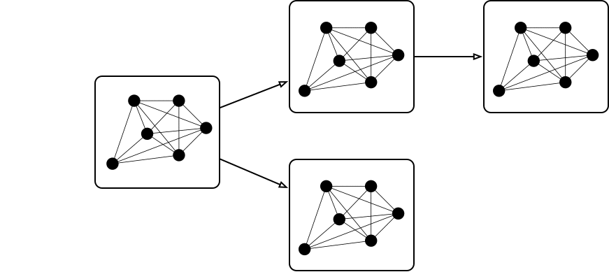

Graph
=====

.. attention::
    Management of a graph of Klio jobs is not supported in **batch** mode,
    as Klio cannot trigger parent jobs to generate missing data in batch mode.
    However, you can still use Klio's (default or custom) data existence checks
    to drop messages where input data doesn't exist,
    as well as data output existence checks to skip already processed items.

    We recommend making use of an external orchestration framework (such as `Luigi`_)
    to manage dependencies between Klio batch jobs.

    From this point on, any reference to a Klio job on this page
    will mean a Klio **streaming** job.

In **streaming** mode, Klio makes use of `Google Pub/Sub`_ and `GCS buckets`_
to create a directed acyclic graph (DAG) to string job dependencies together,
allowing various modes of execution.

Klio supports two styles of execution for **streaming** jobs: :ref:`top-down <top-down>` and :ref:`bottom-up <bottom-up>`.

.. _top-down:

Top-Down Execution
------------------

With top-down execution, every Klio job in the graph is run for every file submitted to it.

Here we have a graph of Klio jobs. A Pub/Sub message containing a :ref:`kliomessage` (which in it
contains a reference to a unique file) is published to the left-most job (the "apex" job). That
job runs the necessary logic on the referenced file. Once it's done, it publishes a ``KlioMessage``
to Pub/Sub for the child jobs to consume. Once those child jobs finish, they publish a
``KlioMessage`` to Pub/Sub for their child jobs to consume, and so on.

This continues until all jobs in a graph have been executed for a particular audio file.

.. note::

    Any job can be an "apex" node!

    While the above animation shows a message being published to the root of the overall graph,
    you may publish messages to any job directly. Depending on the execution mode of the published
    message (top-down or bottom-up), any job downstream of the originally-triggered job may
    (top-down) or may not (bottom-up) be triggered.

.. _bottom-up:

Bottom-Up Execution
-------------------

It's not always efficient or necessary to run every Klio job in the graph for a given file. Maybe
you just want to run a single job for a file, which sometimes means running the parent Klio jobs
to fill in missing dependencies.

In bottom-up execution mode, missing dependencies for a particular job are recursively created.

Here we have another graph of Klio jobs, and we publish a Pub/Sub message (a reference to a file)
to our Klio job, the right-most node here.

.. figure:: images/bottom_up.gif
    :alt: bottom-up execution flow

Klio will first check to see if the input file for that file is available to download. If it sees
that it's missing, Klio will submit a :ref:`kliomessage` to Pub/Sub of the same file reference to
the parent job that generates the input file. If the input to that job is _also_ missing, Klio
will submit the same Pub/Sub message to _its_ parent.

When the parent job finishes, it essentially resubmits work to child jobs. But Klio is smart
enough to not let it trigger _all_ child jobs – only the jobs that are in the direct path of the
originating job is triggered. Other child jobs won't do any unnecessary work.

Bottom-up execution is particularly useful whenever work needs to be re-run in just one part of
the graph.

.. _Google Pub/Sub: https://cloud.google.com/pubsub/docs
.. _GCS buckets: https://cloud.google.com/storage/docs
.. _Luigi: https://github.com/spotify/luigi
