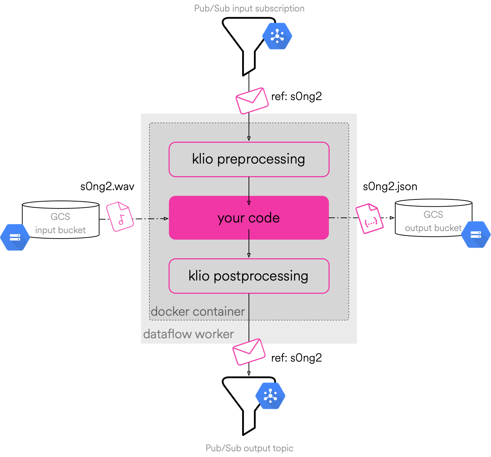

Klio Job Overview
=================

A typical **streaming** Klio job is a Python Dataflow job running Dockerized workers that:

1. reads messages from a `Pub/Sub`_ input subscription (potentially subscribed to the output topic of another job) where each message has a reference to binary data;
2. downloads that binary data from a `GCS bucket`_;
3. processes the downloaded data by applying transforms (which may include running Python libraries with C extensions, Fortran, etc);
4. uploads the derived data to another `GCS bucket`_;
5. writes a message to a single `Pub/Sub`_ output topic so downstream Klio jobs may process the derived data.

Here’s an overview diagram of how this works:

The above architecture overview mentions a few resources in Google Cloud that a typical streaming
Klio job needs. While Dataflow handles the execution of a job, Klio makes use of Pub/Sub and GCS
buckets to create a :doc:`DAG <graph>` to string job dependencies together, allowing for
:ref:`top-down <top-down>` and :ref:`bottom-up <bottom-up>` execution.

.. _Pub/Sub: https://cloud.google.com/pubsub/docs
.. _GCS bucket: https://cloud.google.com/storage/docs
