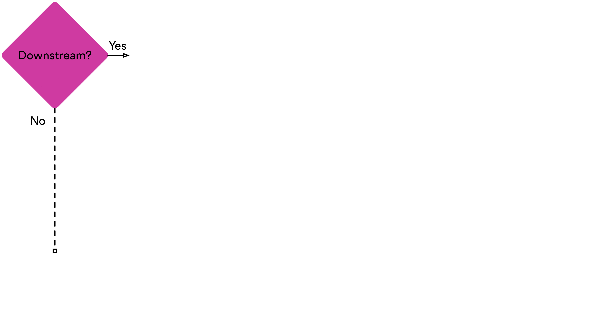

.. _klio-message:

Klio Message
============

The ``KlioMessage`` is protobuf data passed between transforms (and streaming jobs). Its data
represents one unit of work for a transform.

The ``KlioMessage`` is found in ``klio.proto`` and can be imported via
``klio_core.proto.klio_pb2``.

See the :ref:`FAQs page <faqs>` for :ref:`how to work with non-KlioMessages <non-klio-msgs>`,
:ref:`how to publish KlioMessages from a non-Klio job <non-klio-publish>`, and
:ref:`using custom protobuf messages <custom-proto-msgs>`.

.. _msg-proc-logic:

Processing Logic
----------------

When a streaming job is running and it receives a ``KlioMessage``, Klio first detects if the
job is in the message's downstream path, signifying either :ref:`bottom-up <bottom-up>` or :ref:`top-down <top-down>` execution. If the job is not in the downstream path and is not an intended
recipient of the message, then it should **not** process this message. Klio will then drop the
message for no further processing.

If the job should process the received message, then Klio looks to see if the message is in
:ref:`ping-mode <ping-mode>`. If it is, then the message is just passed through and published to the job’s
output topic.

If the message is **not** in :ref:`ping-mode <ping-mode>`, Klio then checks to see if the output data for
the message already exists. If it **does** exist, then Klio looks to see if the message itself
of the pipeline is configured to :ref:`force-reprocess <force-mode>` already-generated output. If
not, then the message is just passed through and published to the job’s output topic.

If the output data does not exist, or :ref:`force mode <force-mode>` is turned on, then Klio checks
to see if the input data for the message exists. If not, Klio will drop the message and log that it
can't process any further.

.. note::

    **Coming soon!** The ability for Klio to automatically trigger parent jobs for when input
    data doesn't exist is in development.

If the input data does exist, then Klio will invoke the rest of the user's pipeline as defined in
``run.py``.

    *Message handling: Klio will either drop the message if it doesn't need to or cannot process it, pass through the message directly to the output topic to avoid unnecessary work, or process the message if all conditions are met.*

.. _proto-defs:

Protobuf Definitions
--------------------

.. _kliomessage:

``KlioMessage``
^^^^^^^^^^^^^^^

.. option:: metadata

    Metadata related to the message.

    | *Type:* :ref:`Metadata`
    | *Required*

.. option:: data

    Data of the message.

    | *Type:* :ref:`Data`
    | *Required*

.. option:: version

    Version of the message.

    | *Type:* :ref:`Version`
    | *Required*

.. _metadata:

``KlioMessage.Metadata``
~~~~~~~~~~~~~~~~~~~~~~~~

.. option:: downstream

    Jobs by which the message must be processed. If empty, then all jobs that receive the message
    will process it. If not empty, then the job will check if itself is listed within
    ``downstream``. If it's not, the message will be ignored and no work will be processed.

    *Deprecated.* Users should migrate to ``Metadata.intended_recipients``.

    | *type:* :ref:`KlioJob`
    | *repeated*

.. option:: visited

    Jobs by which the message has already been processed. No jobs are repeated. When a message is
    in ping mode (by setting ``ping`` to ``True``), this is used to log/visualize the DAG.

    | *type:* :ref:`KlioJob`
    | *repeated*

.. option:: job_audit_log

    Audit log for all jobs that the message has visited. This can be considered the audit trail
    for a message.

    | *type:* :ref:`auditlog`
    | *repeated*

.. option:: ping

    If ``True``, then no transformation work will be done for this message, and the message will
    be published to the job's output topic(s). The job will log about the received message. This
    is meant for debugging and/or visualizing the DAG.

    | *Type:* ``bool``
    | *Optional, default:* ``False``

.. option:: force

    If ``True``, and if the output data already exists for the message, then the job will force
    the transform to run again.

    | *Type:* ``bool``
    | *Optional, default:* ``False``

.. option:: intended_recipients

    Jobs by which the message must be processed. Used to detected between
    :ref:`top-down <top-down>` and :ref:`bottom-up <bottom-up>` execution modes.

    | *Type:* :ref:`recipients`
    | *Required* for v2

.. _recipients:

``KlioMessage.Metadata.Recipients``
~~~~~~~~~~~~~~~~~~~~~~~~~~~~~~~~~~~

One of the following attributes are required:

.. option:: anyone

    Current message is intended for any recipient, signifying :ref:`top-down <top-down>`
    execution. Mutually exclusive with ``KlioMessage.Metadata.Recipients.limited``.

    | *Type:* :ref:`anyone`

.. option:: limited

    Current message is intended for the included recipients, signifying
    :ref:`bottom-up <bottom-up>` execution. Mutually exclusive with
    ``KlioMessage.Metadata.Recipients.anyone``.

    | *Type:* :ref:`limited`

.. _anyone:

``KlioMessage.Metadata.Recipients.Anyone``
~~~~~~~~~~~~~~~~~~~~~~~~~~~~~~~~~~~~~~~~~~

This is an empty "stub" message. Its presence is used to simply signify :ref:`top-down <top-down>`
execution.

.. _limited:

``KlioMessage.Metadata.Recipients.Limited``
~~~~~~~~~~~~~~~~~~~~~~~~~~~~~~~~~~~~~~~~~~~

.. option:: recipients

    An array of KlioJobs. Only jobs included in ``recipients`` should process the message.
    Otherwise, the job should just drop the message to avoid further processing.

    | *Type:* :ref:`kliojob`
    | *Repeated*

.. option:: trigger_children_of

    When set to a particular job, it signifies that the message was *originally* in
    :ref:`top-down <top-down>` execution mode across a :doc:`graph <../anatomy/graph>` of jobs,
    but a dependency was missing for the job assigned to ``trigger_children_of``, therefore
    triggering :ref:`bottom-up <bottom-up>` execution for a subset of the graph. Once
    dependencies are made available, the job triggering bottom-up execution for that subset
    should then return the message to top-down mode. This is done by re-assigning
    ``KlioMessage.Metadata.intended_recipients`` to ``Anyone``.

    | *Type:* :ref:`kliojob`

.. _data:

``KlioMessage.Data``
~~~~~~~~~~~~~~~~~~~~

.. option:: element

    The reference identifier that refers to a particular file on which the job will perform work.

    | *Type:* ``bytes``
    | *Required*

.. option:: payload

    Data shared between transforms. It reflects what the previous transform in the pipeline
    returned/yielded (if that transform was decorated with the :ref:`handle-klio` decorator). The
    first transform in the pipeline after reading from event input will always be ``None``.

    See :doc:`transforms` for how to make use of a message's payload.

    | *Type:* ``bytes``
    | *Optional*

.. option:: entity_id

    The reference identifier that refers to a particular file on which the job will perform work.

    *Deprecated.* Users should migrate to ``data.element``.

    | *Type:* ``bytes``
    | *Required*

.. _kliojob:

``KlioJob``
^^^^^^^^^^^

.. warning::

    ``KlioJob`` will be undergoing API changes for v2 of Klio.

.. option:: job_name

    Name of job (as configured in ``klio-job.yaml::job_name``).

    | *Type:* ``string``
    | *Required*

.. option:: gcp_project

    GCP project of job (as configured in ``klio-job.yaml::pipeline_options.project``).

    | *Type*: ``string``
    | *Required for Dataflow*

.. option:: inputs

    The job's event & data input(s)

    *Marked for deprecation.*

    | *Type*: :ref:`job-input`.
    | *Repeated*

.. _job-input:

``KlioJob.JobInput``
~~~~~~~~~~~~~~~~~~~~

.. warning::

    ``KlioJob.JobInput`` has been marked for deprecation for v2.

.. option:: topic

    The job's Pub/Sub input topic.

    | *Type*: ``string``
    | *Required*

.. option:: subscription

    The job's Pub/Sub input subscription.

    | *Type*: ``string``
    | *Optional*

.. option:: data_location

    The job's Pub/Sub input location of input GCS data.

    | *Type*: ``string``
    | *Optional*

.. _auditlog:

``KlioJobAuditLogItem``
^^^^^^^^^^^^^^^^^^^^^^^

.. option:: timestamp

    Timestamp of when the audit log item was created.

    | *Type:* ``google.protobuf.Timestamp``
    | *Required*

.. option:: klio_job

    The ``KlioJob`` that is working on the message.

    | *Type:* :ref:`kliojob`
    | *Required*

.. _version:

``Version``
^^^^^^^^^^^

.. option:: UNKNOWN

    No version set.

.. option:: V1

    Version 1 of ``KlioMessage``.

.. option:: V2

    Version 2 of ``KlioMessage``.

.. todo::

    Link to ``klio.proto`` file in the page above once the repo is public. Otherwise the doc build
    will fail.
